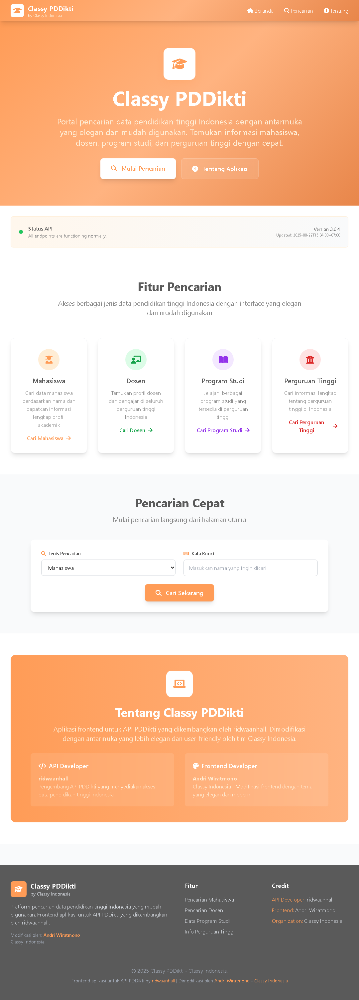
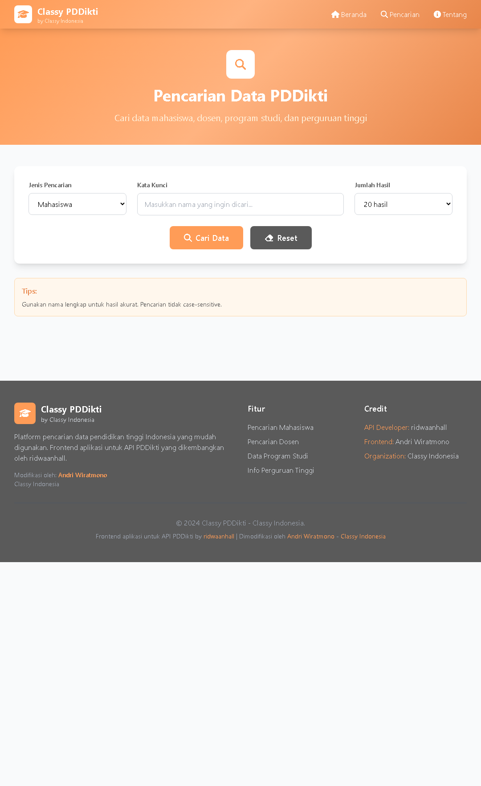

# Classy PDDikti Frontend

Aplikasi web frontend untuk pencarian data PDDikti Indonesia dengan tema Classy Indonesia yang elegan dan modern.

## Preview




## Features

- 🔍 Pencarian data mahasiswa dan dosen
- 📱 Responsive design (mobile-friendly)
- ✨ UI elegan dengan tema Classy Indonesia
- 🚀 Data detail lengkap dengan nama institusi
- 📋 Copy data hasil pencarian
- ⚡ Performa cepat dan ringan

## Quick Start

```bash
# Clone repository
git clone https://github.com/classyid/classy-pddikti-frontend.git
cd classy-pddikti-frontend

# Install dependencies
pip install flask requests

# Run aplikasi
python app.py

# Buka browser
# http://localhost:5000
```

## Tech Stack

- **Backend**: Python Flask
- **Frontend**: HTML5, JavaScript, Tailwind CSS
- **API**: PDDikti API by ridwaanhall
- **Styling**: Tailwind CSS + Font Awesome

## Usage

### Pencarian Mahasiswa
1. Pilih "Mahasiswa"
2. Input nama mahasiswa
3. Klik "Cari Data"
4. Lihat hasil dan klik "Detail" untuk info lengkap

### Pencarian Dosen
1. Pilih "Dosen"
2. Input nama dosen
3. Klik "Cari Data"
4. Lihat hasil dan klik "Detail" untuk info lengkap

## API Integration

Aplikasi ini menggunakan API PDDikti yang dikembangkan oleh **ridwaanhall**:

- **API Docs**: [pddikti-docs.ridwaanhall.com](https://pddikti-docs.ridwaanhall.com/)
- **API Repo**: [github.com/ridwaanhall/api-pddikti](https://github.com/ridwaanhall/api-pddikti)

## File Structure

```
classy-pddikti-frontend/
├── app.py                 # Flask backend
├── templates/
│   ├── base.html         # Base template
│   ├── index.html        # Home page
│   ├── search.html       # Search page
│   └── about.html        # About page
├── static/               # Static files (jika ada)
├── requirements.txt      # Dependencies
└── README.md
```

## Environment Setup

### Production
```bash
export FLASK_ENV=production
export API_BASE_URL=https://api-pddikti.ridwaanhall.com
```

### Development
```bash
export FLASK_ENV=development
export FLASK_DEBUG=1
```

## Deployment

### Heroku
```bash
# Install Heroku CLI
heroku create classy-pddikti
git push heroku main
```

### Railway
```bash
# Connect repository to Railway
# Auto-deploy dari GitHub
```

### Manual Server
```bash
# Install gunicorn
pip install gunicorn

# Run dengan gunicorn
gunicorn --bind 0.0.0.0:5000 app:app
```

## Contributing

1. Fork repository
2. Buat branch baru (`git checkout -b feature/amazing-feature`)
3. Commit changes (`git commit -m 'Add amazing feature'`)
4. Push ke branch (`git push origin feature/amazing-feature`)
5. Buat Pull Request

## Credits

### API Developer
- **ridwaanhall** - PDDikti API Backend & Data Integration
- API Documentation: [pddikti-docs.ridwaanhall.com](https://pddikti-docs.ridwaanhall.com/)

### Frontend Developer
- **Andri Wiratmono** - UI/UX Design & Frontend Development
- **Classy Indonesia** - Theme Design & Brand Identity

## License

MIT License

## Support

Jika ada masalah atau pertanyaan:
- Buat issue di repository ini
- Contact: Classy Indonesia

---

**Classy Indonesia** - Solusi teknologi yang elegan dan berkualitas
